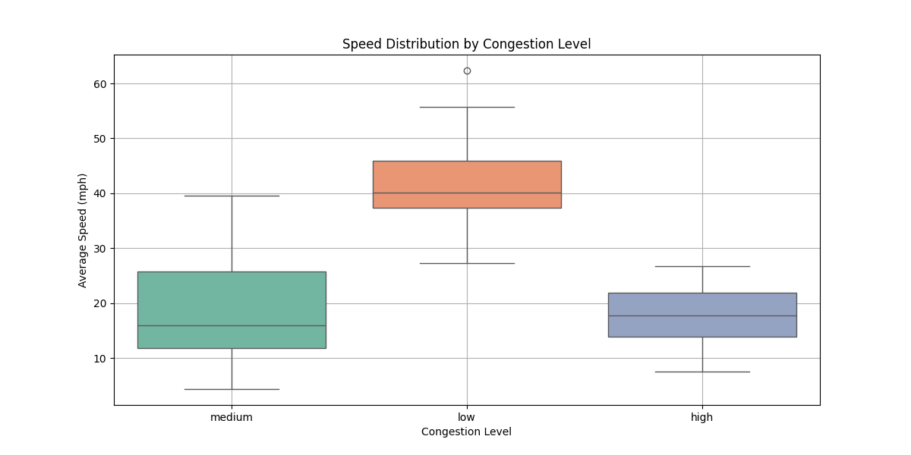

# LaneWise - A Smart Traffic Lane Decision Tool


## Project Demo
<div align="center">
  <a href="https://www.youtube.com/watch?v=WUKw49KUePA">
    
  </a>
</div>

## Project Overview
LaneWise is a real-time traffic lane decision system that helps drivers optimize their lane choice on highways by analyzing traffic patterns using machine learning clustering techniques. The system processes high-resolution traffic data to provide data-driven lane recommendations, aiming to reduce congestion and improve traffic flow.

## Data Processing Implementation

### Dataset
- Using NGSIM Vehicle Trajectories dataset ([source](https://data.transportation.gov/Automobiles/Next-Generation-Simulation-NGSIM-Vehicle-Trajector/8ect-6jqj/data_preview))
- 4.4 million records of I-80 traffic data covering diverse traffic conditions
- Rich feature set including:
  - Vehicle speeds and positions
  - Lane change events and trajectories
  - Time-stamped vehicle movements
  - Inter-vehicle spacing measurements
- High-resolution temporal data (0.1 second intervals)
- Professional-grade data quality from US DOT

### Data Processing Strategy
The system processes raw trajectory data through several stages:

1. **Temporal Aggregation**:
   - Groups data into 5-minute windows
   - Reduces 0.1-second readings to manageable summaries
   - Smooths out momentary traffic fluctuations
   - Enables real-time processing capabilities

2. **Feature Engineering**:
   ```python
   class LaneWiseSystem:
       def __init__(self):
           self.scaler = StandardScaler()
           self.clustering_model = KMeans(n_clusters=5, random_state=42)
           
       def load_and_preprocess_data(self, data_input):
           # Process raw trajectory data into lane metrics
           lane_metrics = self.data.groupby(
               ['lane_id', pd.Grouper(key='timestamp', freq='5T')]
           ).agg({
               'vehicle_count': 'count',  # Cars per lane
               'avg_speed': 'mean',       # Average velocity
               'avg_space': 'mean',       # Inter-vehicle spacing
               'avg_time': 'mean'         # Time between vehicles
           })
   ```

3. **Metric Calculations**:
   - Vehicle density per lane
   - Average speeds
   - Space headway (physical distance between vehicles)
   - Time headway (temporal separation between vehicles)

4. **Data Standardization**:
   - Feature scaling for consistent model input
   - Outlier detection and handling
   - Missing value imputation where necessary

## Machine Learning Implementation

### Clustering Model Architecture
- K-means clustering algorithm with 5 distinct clusters
- Feature set:
  - Normalized vehicle count
  - Standardized average speed
  - Calibrated space headway
  - Adjusted time headway
- Model Performance:
  - Silhouette score: 0.43 (indicating good cluster separation)
  - Processing time: ~9 seconds for 4.4M records
  - Consistent cluster assignments across multiple runs

### Real-time Analysis Results
Sample output from actual data processing:
```
Lane 7 Analysis Results:
Time Period 1:
- Congestion: High
- Score: 1.0 (Recommended)
- Metrics: 17,779 vehicles, 12.4 mph avg, 38.0 ft spacing

Time Period 2:
- Congestion: High
- Score: 0.39 (Not Recommended)
- Metrics: 22,467 vehicles, 7.8 mph avg, 33.8 ft spacing
```

### Preliminary Results

#### 1. Speed Distribution Analysis

- Low congestion: 45-60 mph (optimal flow)
- Medium congestion: 20-35 mph (reduced efficiency)
- High congestion: 5-25 mph (significant slowdown)

#### 2. Traffic Pattern Correlations

- Strong positive correlation (0.83) between speed and space headway
- Significant negative correlation (-0.55) between speed and time headway
- Notable inverse relationship between vehicle count and speed (-0.29)

#### 3. Lane Classification Results

- Distinct cluster separation showing clear traffic patterns
- Reliable congestion level mapping
- Consistent classification across different time periods

## Next Development Phase
1. Video Feed Integration:
   - Processing NGSIM I-80 video footage
   - Real-time computer vision analysis
   - Visual validation of metrics

2. Enhanced Feature Engineering:
   - Weather condition impact analysis
   - Time-of-day traffic patterns
   - Seasonal variation considerations

3. System Optimization:
   - Improved processing efficiency
   - Enhanced real-time capabilities
   - Mobile platform development
  
## Installation Guide
```bash
git clone https://github.com/yourusername/lanewise.git
cd server
python lane_wise_system.py  # Train model
pip install -r requirements.txt
uvicorn api:app --reload  # Start server

cd ../client
npm install
npm start  # Start frontend
```

## Repository Structure
```
lanewise/
├── client/              # React frontend
└── server/
    ├── app.py          # FastAPI application
    ├── lane_wise_system.py
    ├── models/
    └── data/
```


Final Project: 

Changes made:
- Switched from KMeans to Kmeans++ with 10 initial clusters instead of 3
- Increased Siolute Score from 0.4455799938938888 to  0.5183785567278202