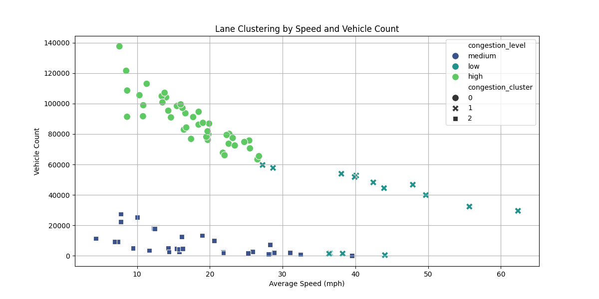
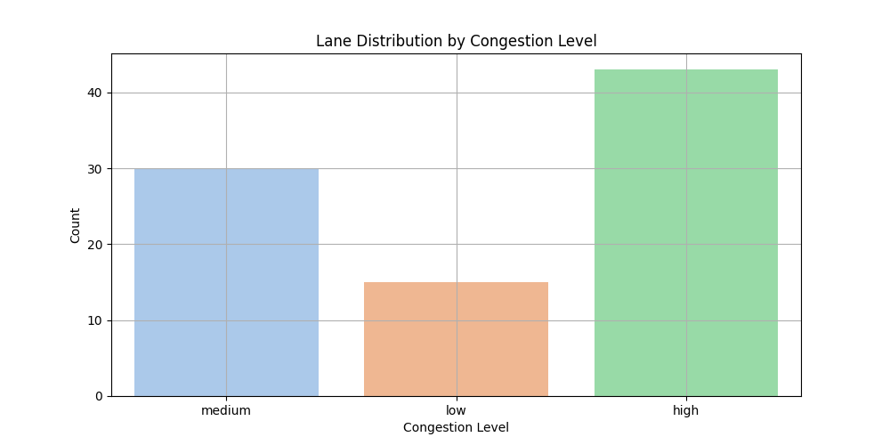

<h1>LaneWise - A Smart Traffic Lane Decision Tool</h1>

<h2>Project Demo (Mid - Semester)</h2>

  

<h2>Project Overview</h2>

<strong>LaneWise</strong> is a real-time traffic lane decision system that leverages machine learning clustering techniques to guide drivers in choosing optimal lanes on highways. By processing high-resolution traffic data, LaneWise identifies distinct congestion patterns and recommends lanes based on current and projected traffic conditions. The goal is to reduce congestion, enhance traffic flow efficiency, and improve overall driving experiences.

<h2>Build and Run Instructions</h2>

<h3>Dataset Setup (Required)</h3>
<ol>
  <li>Download the NGSIM Vehicle Trajectories dataset from <a href="https://data.transportation.gov/Automobiles/Next-Generation-Simulation-NGSIM-Vehicle-Trajector/8ect-6jqj/data_preview">data.transportation.gov</a></li>
  <li>Save the downloaded CSV file as <code>Next_Generation_Simulation__NGSIM__Vehicle_Trajectories_and_Supporting_Data.csv</code> in the <code>server/data/</code> directory</li>
</ol>

<h3>Dependencies & Setup</h3>

Before running LaneWise, ensure you have:

<ul>
  <li>Python 3.9+ installed</li>
  <li>Node.js and npm installed</li>
  <li>GNU Make installed</li>
</ul>

<h3>Automated Setup (Make)</h3>
    
To start the application, use the following command. It will take 1-2 minutes to setup:

    <pre><code>make run</code></pre>

<pre>
make install     # Installs Python and Node.js dependencies
make build      # Builds the frontend and backend artifacts
make run        # Starts the backend server and frontend development server
</pre>

<h3>Manual Setup</h3>
<ol>
  <li><strong>Backend:</strong>
    <pre class="code-block">
cd server
pip install -r requirements.txt
# Ensure dataset is in server/data/ directory
python lane_wise_system.py   # Train model & save artifacts
uvicorn api:app --reload     # Start FastAPI backend at localhost:8000
    </pre>
  </li>
  <li><strong>Frontend:</strong>
    <pre class="code-block">
cd client
npm install
npm start   # Launches React frontend on localhost:3000
    </pre>
  </li>
</ol>

<h2>Data Processing and Modeling</h2>

<h3>Dataset</h3>

I utilize the NGSIM Vehicle Trajectories dataset from I-80. This dataset includes 400,000 of time-stamped records at 1-second intervals, capturing a wide range of traffic conditions. Key features:

<ul>
  <li>Vehicle speeds (v_Vel)</li>
  <li>Positions and spacing (Space_Headway)</li>
  <li>Temporal headways (Time_Headway)</li>
  <li>Vehicle counts per lane over time</li>
</ul>

<h3>Data Processing Steps</h3>
<ol>
  <li><strong>Temporal Aggregation:</strong>  
    Raw data at 0.1-second intervals is aggregated into 5-minute segments. This balances capturing trends without overwhelming the model. This step also enables near-real-time updating, as new 5-minute windows continuously roll in.
  </li>

  <li><strong>Feature Engineering:</strong>  
    Beyond the raw measures, I derive new features:
    <ul>
      <li><strong>Density:</strong> Vehicles per segment length (e.g., per 0.5 miles), indicating how "crowded" a lane is.</li>
      <li><strong>Flow:</strong> Vehicles per hour, computed by scaling the 5-minute vehicle count by 12.</li>
    </ul>
    Density and flow provide richer context for understanding traffic states. High density and low speed often indicate heavy congestion. High flow with moderate speed might suggest efficient traffic handling.
  </li>

  <li><strong>Scaling & Cleansing:</strong>  
    The data is standardized using <code>StandardScaler</code> to ensure equal weighting of features. Outliers are handled, and missing data points are removed or imputed, ensuring a clean, consistent dataset for modeling.
  </li>
</ol>

<h3>Clustering Model - K-Means++</h3>

I employ the K-means++ initialization to ensure better centroid placement. Initially, I chose <code>n_clusters=3</code> for simplicity, representing <em>low</em>, <em>medium</em>, and <em>high</em> congestion states. I use features:

<ul>
  <li>vehicle_count</li>
  <li>avg_speed</li>
  <li>avg_space</li>
  <li>avg_time</li>
  <li>density</li>
  <li>flow</li>
</ul>

The model naturally groups lanes based on how these metrics co-vary. After fitting the model and scaling data, I assign congestion levels based on cluster center speeds. The cluster with the highest average speed becomes <strong>low congestion</strong>, the lowest speed cluster is <strong>high congestion</strong>, and the remaining cluster is <strong>medium congestion</strong>.

<h2>Visualizations of Data</h2>

<h3>Speed Distribution by Congestion Level</h3>

This box plot illustrates distinct speed ranges for each congestion level:
<ul>
  <li><em>Low Congestion:</em> Higher speeds, narrower variability.</li>
  <li><em>Medium Congestion:</em> Moderate speeds, more variability.</li>
  <li><em>High Congestion:</em> Significantly lower speeds, indicating slowed traffic.</li>
</ul>
The vertical spread shows that low-congestion lanes maintain consistently higher speeds, reflecting optimal flow conditions. Medium congestion lanes exhibit speeds in the 15-30 mph range, while high congestion lanes struggle with speeds often below 15 mph.

<h3>Lane Clustering by Speed and Vehicle Count</h3>

This scatter plot maps each lane's average speed against its vehicle count. Symbols and colors denote cluster assignments:
<ul>
  <li><strong>Low (green):</strong> High speed, moderate-to-low vehicle counts.</li>
  <li><strong>Medium (blue):</strong> Mid-range speeds and intermediate vehicle counts.</li>
  <li><strong>High (teal):</strong> Lower speeds with often higher counts, indicating congested states.</li>
</ul>
This visualization confirms that the clustering separates lanes into meaningful traffic states without hand-tuned thresholds.

<h3>Lane Distribution by Congestion Level</h3>

The histogram shows how many lanes fall into each congestion level. This distribution reflects typical roadway usage patterns. A balanced distribution suggests the method is capturing a range of conditions rather than forcing all lanes into a single category.

<h3>Metric Correlations</h3>

The correlation heatmap reveals relationships between features:
<ul>
  <li><strong>avg_speed & avg_space (0.83):</strong> More spacing often accompanies higher speeds, reflecting smoother traffic flow.</li>
  <li><strong>avg_speed & avg_time (-0.55):</strong> Higher speeds reduce time headways as vehicles move more freely.</li>
  <li><strong>vehicle_count & avg_speed (-0.29):</strong> More vehicles often means lower speeds, although the correlation is moderate.</li>
</ul>
This informs feature selection and helps interpret cluster assignments.

<h2>Results and Achieving the Goal</h2>

My ultimate goal was to provide a data-driven method to classify and recommend lanes based on traffic patterns. With K-means++ and additional features (density, flow), I achieved:

<ul>
  <li><strong>Improved Silhouette Score (~0.52):</strong> Indicates that clusters are better separated and more cohesive than before.</li>
  <li><strong>Meaningful Congestion Classes:</strong> Lanes classified as "low congestion" truly exhibit higher speeds and better throughput. "High congestion" lanes show the opposite, and "medium" lanes fall in between.</li>
  <li><strong>Realistic Recommendations:</strong> The recommended lane ("low") often corresponds to conditions drivers prefer—higher speeds and reasonable density—validating that the model output aligns with intuitive traffic conditions.</li>
</ul>

These results show that I met my objective: using machine learning to transform raw trajectory data into actionable lane recommendations. The improvements in cluster quality, combined with meaningful labeling, demonstrate success.

<em>Final Project Changes:</em> 
- I adopted K-means++ initialization and refined <code>n_clusters=3</code> for balanced clustering. 
- I added density and flow features for richer traffic context. 
- I achieved an improved silhouette score (~0.52), indicating more meaningful cluster groupings. 
- I introduced a makefile, GitHub workflow, and tests to ensure reproducibility and maintain code quality over time.
